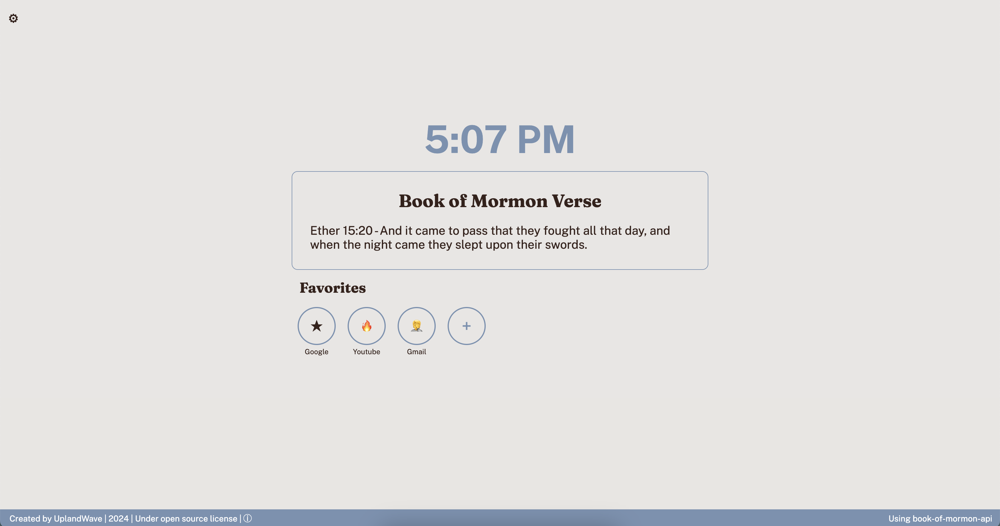

# BOM-Day Extension (Book of Mormon Daily)

## Overview
**BOM-Day** is a simple and easy to use Chrome extension that displays a new and random verse from the Book of Mormon. With the ability to **save links favorite sites** and **change the themes** to fit your preferences.

## Host It Locally  
I have no money to become a Chrome developer, but you can host Chrome extension from a file on your own computer. 

**Instructions**
1. Go to the "Manage Extensions" tab
2. Turn "Developer Mode"
3. Click "Load Unpacked" 
4. Find where you cloned this repository on your computer and select the folder
5. It should now appear as a normal extension

## Intended Use
Created to serve as a new default home screen for new tabs or windows. It provides a quick reminder to read the scriptures often and looks great. (If thats something you get behind)

## Features
- **Random Verse:** Pulls a new and random verse from the Book of Mormon.
- **Change Theme:** You have the ability to change the theme have it your way.
- **Quick Links:** Freedom to add links to sites you use often.
- **Super Private:** It is all stored locally, **100% privacy guaranteed**.
- **Inspirational:** Helps maintain a daily habit of reading scripture.
- **Minimalistic Design:** Clean and distraction-free interface, no fed adds.

## License
**This project is licensed under the EDUCATIONAL/DEMONSTRATION USE LICENSE - see the [LICENSE](./LICENSE.txt) file for details.**

## Work in Progress
- Adding number shortcut fictionality to new tab for fast redirecting
- Building in background image api
- Adding meme api click to show funtion
